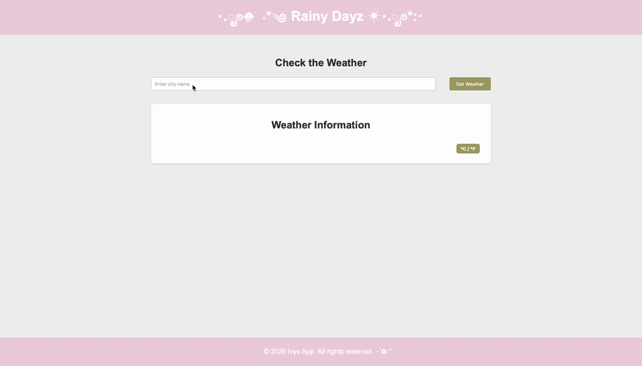

# Rainy Dayz Weather App

A responsive weather application that allows users to search for any city and view current
weather conditions in real time. The app retrieves weather data from the OpenWeatherMap API
and dynamically updates the interface with detailed weather information.

## Features

- Search for weather information by city name
- Real-time weather data retrieval using the OpenWeatherMap API
- Temperature unit toggle between Celsius and Fahrenheit
- Displays weather description, humidity, pressure, wind speed, and visibility
- Shows sunrise and sunset times adjusted for the city's timezone
- Search history with quick-access buttons for previously searched cities

## Technologies Used

- HTML
- CSS
- JavaScript
- REST API integration

## How to run

1. Clone the repository:
git clone https://github.com/your-username/Ivy-weather-app.git

2. Open index.html in your browser
   
##Demo

